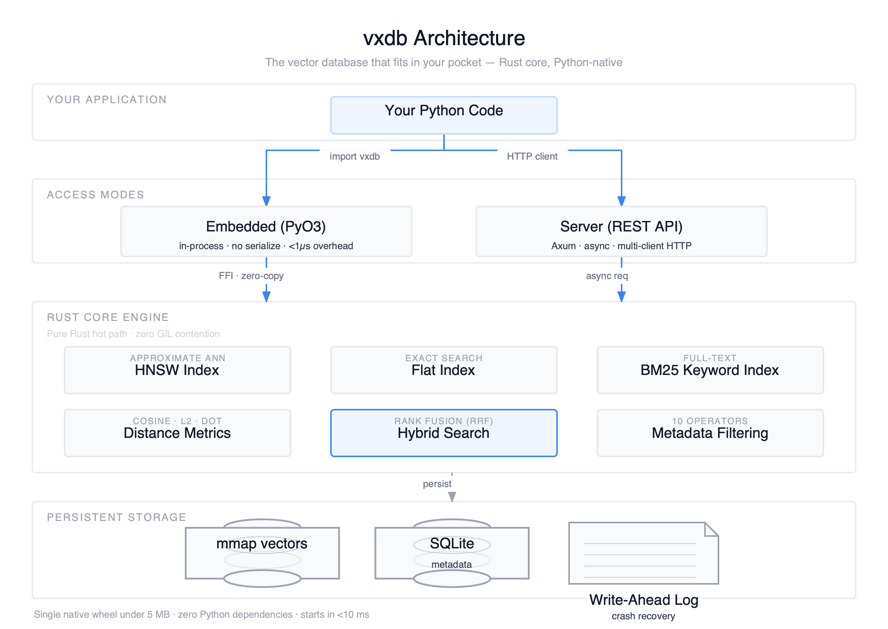

# vxdb

[](https://pypi.org/project/vxdb/)
[](https://github.com/getmykhan/vxdb/actions/workflows/ci.yml)
[](https://pypi.org/project/vxdb/)
[](LICENSE)

**The vector database that fits in your pocket.**

Rust-powered. Python-native. One `pip install` away.

---

```python
pip install vxdb
```

```python
import vxdb

db = vxdb.Database(path="./my_data")  # persistent — data survives restarts
collection = db.create_collection("docs", dimension=384)

embed = your_embedding_function  # OpenAI, Sentence Transformers, Cohere, etc.

collection.upsert(
    ids=["a", "b"],
    vectors=[embed("how to train a model"), embed("best pasta recipe")],
    documents=["how to train a model", "best pasta recipe"],
)

collection.query(vector=embed("machine learning"), top_k=5)
```

`embed()` is any function that turns text into vectors — see [examples/](examples/) for OpenAI, Sentence Transformers, LangChain, and Cohere.

That's it. No Docker. No config files. No cloud account. No 500 MB of dependencies.

---

## Why developers choose vxdb

### Stupid fast

The entire hot path — distance computation, HNSW traversal, BM25 scoring, mmap I/O — is **pure Rust** with zero GIL contention. Your Python code calls directly into compiled native code via PyO3. No serialization overhead. No REST round-trips. No subprocess.

### Stupid light

A single native wheel **under 5 MB** with **zero Python dependencies**. Starts in **under 10 ms**. No numpy. No scipy. No protobuf. No grpcio version conflicts. Just `pip install vxdb` and you're done.

### Runs anywhere

Laptop. CI pipeline. Raspberry Pi. AWS Lambda. Docker container. Air-gapped server. Anywhere Python runs, vxdb runs. No infrastructure required to get started — scale up to a standalone server when you need it.

### Hybrid search built-in

Vector similarity + BM25 keyword matching fused via **Reciprocal Rank Fusion**. One API call. Tunable `alpha` parameter. No separate search engine needed. No Elasticsearch sidecar.

Other databases like Qdrant, Milvus, and Zvec support hybrid search too — but they require you to run a separate sparse encoder (BM25 or SPLADE) yourself and pass pre-computed sparse vectors. vxdb computes BM25 internally from the documents you already upserted. One call: `hybrid_query(vector=..., query="text", alpha=0.5)`. No extra step.

### Dual-mode: embedded + server

Many databases now offer an "embedded" mode — but the implementations vary widely. Qdrant's local mode is a Python reimplementation (not their Rust engine). Weaviate embedded downloads a Go binary and runs it as a subprocess. Milvus Lite works but is limited to Linux/macOS and recommended for <1M vectors.

vxdb's embedded mode is the **real Rust engine** compiled directly into a Python extension via PyO3. No serialization. No subprocess. No network. And the same engine powers the standalone REST server — start in a notebook, scale to multi-client HTTP when you're ready. No rewrite.

---

## The full picture



---

## Quick Start

### 3 lines to your first search

```python
import vxdb

# Persistent (data survives restarts)
db = vxdb.Database(path="./my_data")

# Or in-memory (ephemeral, great for prototyping)
# db = vxdb.Database()

collection = db.create_collection("docs", dimension=384, metric="cosine")
```

### Insert vectors

```python
collection.upsert(
    ids=["a", "b", "c"],
    vectors=[[0.1, 0.2, ...], [0.3, 0.4, ...], [0.5, 0.6, ...]],
    metadata=[{"type": "article"}, {"type": "blog"}, {"type": "article"}],
    documents=["intro to ML", "my favorite recipes", "deep learning guide"],
)
```

### Search — four ways

```python
# 1. Vector similarity
results = collection.query(vector=[0.1, 0.2, ...], top_k=5)

# 2. Filtered (metadata constraints)
results = collection.query(
    vector=[0.1, ...], top_k=5,
    filter={"type": {"$eq": "article"}}
)

# 3. Hybrid (vector + keyword — the sweet spot)
results = collection.hybrid_query(
    vector=[0.1, ...],
    query="machine learning",
    top_k=5,
    alpha=0.5,  # 0=keyword only, 1=vector only
)

# 4. Keyword only (BM25)
results = collection.keyword_search(query="machine learning", top_k=5)
```

Every result returns `{"id", "score", "metadata", "document"}`.

---

## Installation

```bash
pip install vxdb
```

That's the whole thing. Works on **macOS, Linux, Windows**. Python 3.9+.

For the HTTP client (talking to a remote vxdb server):

```bash
pip install 'vxdb[server]'
```

---

## Embedding Providers

vxdb stores **pre-computed vectors** — bring any embedding model you want. We have step-by-step notebooks for each:


| Provider                     | Install                             | API Key?   | Notebook                                                                       |
| ---------------------------- | ----------------------------------- | ---------- | ------------------------------------------------------------------------------ |
| **OpenAI**                   | `pip install openai`                | Yes        | [examples/openai_embeddings.ipynb](examples/openai_embeddings.ipynb)         |
| **Sentence Transformers**    | `pip install sentence-transformers` | No (local) | [examples/sentence_transformers.ipynb](examples/sentence_transformers.ipynb) |
| **LangChain** (any provider) | `pip install langchain-openai`      | Depends    | [examples/langchain_integration.ipynb](examples/langchain_integration.ipynb) |
| **Cohere**                   | `pip install cohere`                | Yes        | [examples/cohere_embeddings.ipynb](examples/cohere_embeddings.ipynb)         |
| **Ollama** (local LLMs)      | `pip install ollama`                | No (local) | —                                                                              |


Or use the pluggable interface:

```python
from vxdb.embedding import EmbeddingFunction

class MyEmbedder(EmbeddingFunction):
    def embed(self, texts: list[str]) -> list[list[float]]:
        return your_model.encode(texts)
```

---

## Server Mode

Same engine, accessed over HTTP. Deploy it as a standalone service.

```bash
# Start the server
vxdb-server --host 0.0.0.0 --port 8080
```

**Python client:**

```python
from vxdb import Client

client = Client("http://localhost:8080")
coll = client.create_collection("docs", dimension=384)
coll.upsert(ids=["a"], vectors=[[0.1, ...]], documents=["hello world"])
results = coll.hybrid_query(vector=[0.1, ...], query="hello", top_k=5)
```

**cURL:**

```bash
# Create collection
curl -X POST localhost:8080/collections \
  -H "Content-Type: application/json" \
  -d '{"name": "docs", "dimension": 384}'

# Upsert
curl -X POST localhost:8080/collections/docs/upsert \
  -H "Content-Type: application/json" \
  -d '{"ids": ["a"], "vectors": [[0.1, 0.2]], "documents": ["hello world"]}'

# Query
curl -X POST localhost:8080/collections/docs/query \
  -H "Content-Type: application/json" \
  -d '{"vector": [0.1, 0.2], "top_k": 5}'
```

**Docker:**

```bash
docker build -t vxdb .
docker run -p 8080:8080 vxdb    # ~145 MB Debian-based image
```

---

## Hybrid Search

Most vector databases give you vector search OR keyword search. vxdb gives you both, fused intelligently in a single call.

**How it works:**

1. **You upsert with documents** — raw text is tokenized into a built-in BM25 index alongside your vectors
2. **At query time** — vector search and BM25 run in parallel, then Reciprocal Rank Fusion merges both ranked lists
3. **You control the blend** — `alpha=1.0` (pure vector) → `alpha=0.5` (balanced) → `alpha=0.0` (pure keyword)

**When to use it:** Specific product names. Error codes. Proper nouns. Anything where exact terms matter alongside semantic meaning. See [examples/hybrid_search.ipynb](examples/hybrid_search.ipynb) for a deep dive with side-by-side comparisons.

```python
results = collection.hybrid_query(
    vector=embed("lightweight laptop for students"),
    query="MacBook Air M4",
    top_k=5,
    alpha=0.5,
)
```

---

## How vxdb compares


|                                  | vxdb                        | Zvec (Alibaba)              | ChromaDB                | Qdrant                    | Pinecone      | Milvus                  | Weaviate                    | FAISS         |
| -------------------------------- | --------------------------- | --------------------------- | ----------------------- | ------------------------- | ------------- | ----------------------- | --------------------------- | ------------- |
| **Language**                     | Rust                        | C++ (Proxima)               | Rust (v1.0+)            | Rust                      | Proprietary   | Go/C++                  | Go                          | C++           |
| **Embedded mode**                | **PyO3, true in-process**   | In-process                  | In-process              | Python-only local mode    | No            | Milvus Lite             | Subprocess (downloads Go binary) | SWIG bindings |
| **Server mode**                  | **Yes**                     | No                          | Yes                     | Yes                       | Cloud only    | Yes                     | Yes                         | No            |
| **`pip install` just works**     | **Yes**                     | Yes                         | Yes                     | Yes (local mode)          | N/A (SaaS)    | Yes (Milvus Lite)       | Yes (Linux/macOS)           | Yes           |
| **Python dependencies**          | **None (zero)**             | DashText SDK                | Several                 | numpy, grpcio, etc.       | N/A           | grpcio, protobuf, etc.  | grpcio, etc.                | numpy         |
| **Wheel size**                   | **~5 MB**                   | ~30 MB                      | ~20 MB                  | ~50 MB                    | N/A           | ~50 MB+                 | ~100 MB+ (downloads binary) | ~20 MB        |
| **Startup time**                 | **<10 ms**                  | <100 ms                     | <500 ms                 | ~1-3 s (server)           | N/A           | ~5-10 s (server)        | ~3-5 s (server)             | <10 ms        |
| **Hybrid search**                | **Built-in BM25 + RRF**    | BM25 + RRF + weighted       | RRF (dense+sparse)      | RRF, DBSF                 | Sparse+dense  | Sparse vectors          | BM25 + RRF                  | No            |
| **BM25 without external encoder** | **Yes (automatic)**        | Requires DashText SDK       | No                      | Requires sparse encoder   | No            | Requires sparse encoder | Yes                         | No            |
| **Sparse vectors**               | No                          | **Yes**                     | Yes                     | Yes                       | Yes           | Yes                     | No                          | No            |
| **Multi-vector queries**         | No                          | **Yes**                     | No                      | Yes                       | No            | No                      | No                          | No            |
| **Metadata filtering**           | **10 operators**            | Structured filters          | Yes                     | Yes                       | Yes           | Yes                     | Yes                         | No            |
| **Persistence**                  | **mmap + SQLite + WAL**     | Custom engine               | SQLite                  | RocksDB                   | Cloud         | RocksDB                 | LSM                         | Manual        |
| **Crash recovery**               | **WAL**                     | Yes                         | Yes (v1.0)              | Yes                       | Yes           | Yes                     | Yes                         | No            |
| **Quantization**                 | No (planned)                | **int8, RabitQ**            | No                      | Scalar/PQ                 | Yes           | Yes                     | PQ/BQ                       | PQ/SQ         |
| **Docker image**                 | ~145 MB                     | N/A (no server)             | ~200 MB+                | ~100 MB                   | No            | ~1 GB+                  | ~300 MB+                    | No            |
| **Runs offline**                 | **Yes**                     | Yes                         | Yes                     | Yes                       | No            | Yes                     | Yes                         | Yes           |
| **License**                      | **Apache 2.0**              | Apache 2.0                  | Apache 2.0              | Apache 2.0                | Proprietary   | Apache 2.0              | BSD-3                       | MIT           |


---

## API Reference

### Python (Embedded)

```python
# Database
db = vxdb.Database()                  # in-memory (ephemeral)
db = vxdb.Database(path="./my_data")  # persistent (data survives restarts)
db.create_collection(name, dimension, metric="cosine", index="flat")
db.get_collection(name)
db.list_collections()
db.delete_collection(name)

# Collection
collection.upsert(ids, vectors, metadata=None, documents=None)
collection.query(vector, top_k=10, filter=None)
collection.hybrid_query(vector, query, top_k=10, alpha=0.5)
collection.keyword_search(query, top_k=10)
collection.delete(ids)
collection.count()
```

### REST API


| Method   | Endpoint                      | Description                           |
| -------- | ----------------------------- | ------------------------------------- |
| `POST`   | `/collections`                | Create collection                     |
| `GET`    | `/collections`                | List collections                      |
| `DELETE` | `/collections/{name}`         | Delete collection                     |
| `POST`   | `/collections/{name}/upsert`  | Upsert vectors (+ optional documents) |
| `POST`   | `/collections/{name}/query`   | Vector search (+ optional filter)     |
| `POST`   | `/collections/{name}/hybrid`  | Hybrid vector + keyword search        |
| `POST`   | `/collections/{name}/keyword` | BM25 keyword search                   |
| `POST`   | `/collections/{name}/delete`  | Delete vectors by ID                  |
| `GET`    | `/collections/{name}/count`   | Count vectors                         |


### Parameters


| Parameter | Values                                                          | Default    |
| --------- | --------------------------------------------------------------- | ---------- |
| `metric`  | `"cosine"`, `"euclidean"`, `"dot"`                              | `"cosine"` |
| `index`   | `"flat"` (exact), `"hnsw"` (approximate)                        | `"flat"`   |
| `filter`  | `$eq` `$ne` `$gt` `$gte` `$lt` `$lte` `$in` `$nin` `$and` `$or` | —          |
| `alpha`   | `0.0` (keyword) to `1.0` (vector)                               | `0.5`      |


---

## Examples

Interactive Jupyter notebooks with step-by-step walkthroughs:


| Notebook                                                              | What you'll build                      |
| --------------------------------------------------------------------- | -------------------------------------- |
| [quickstart.ipynb](examples/quickstart.ipynb)                       | Every feature in 5 min (no API keys)   |
| [openai_embeddings.ipynb](examples/openai_embeddings.ipynb)         | Semantic search with OpenAI embeddings |
| [sentence_transformers.ipynb](examples/sentence_transformers.ipynb) | Free, local embeddings (no API key)    |
| [langchain_integration.ipynb](examples/langchain_integration.ipynb) | LangChain + RAG pipeline               |
| [cohere_embeddings.ipynb](examples/cohere_embeddings.ipynb)         | Multilingual search with Cohere        |
| [hybrid_search.ipynb](examples/hybrid_search.ipynb)                 | Deep dive: vector vs keyword vs hybrid |


---

## Development

```bash
git clone https://github.com/getmykhan/vxdb.git && cd vxdb

# Rust
cargo build --all
cargo test --all        # 120+ tests

# Python
uv venv .venv && source .venv/bin/activate
uv pip install maturin pytest httpx
maturin develop
PYTHONPATH=python pytest tests/ -v
```

The codebase is a Cargo workspace:

```
vxdb/
├── crates/
│   ├── vxdb-core/       # Engine: indexes, distance, storage, hybrid search
│   ├── vxdb-python/     # PyO3 bindings
│   └── vxdb-server/     # Axum REST API server
├── python/vxdb/         # Python package (client SDK, embedding interface)
├── examples/             # Jupyter notebooks
└── tests/                # Python integration tests
```

---

## Roadmap

- ~~Persistent collections (mmap + SQLite + WAL)~~ **Done**
- SIMD-accelerated distance computation
- Quantization (int8/binary) for reduced memory
- GPU acceleration (CUDA/Metal)
- HNSW graph serialization (fast restart for large indexes)
- Streaming upsert for large datasets
- Sparse vector support
- gRPC API
- Official LangChain `VectorStore` integration
- Kubernetes Helm chart
- Benchmarks suite vs Qdrant, ChromaDB, Zvec, FAISS

---

## License

Apache 2.0